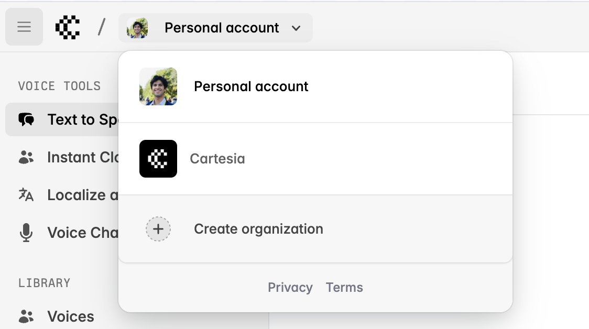
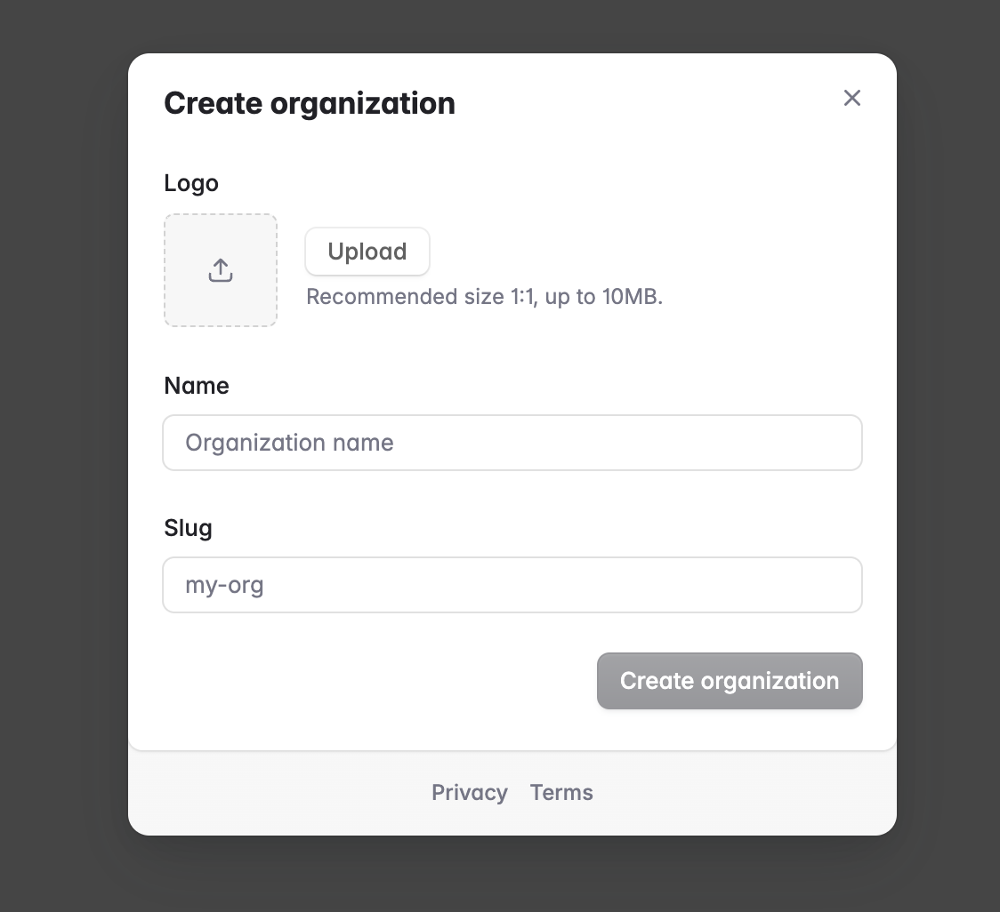
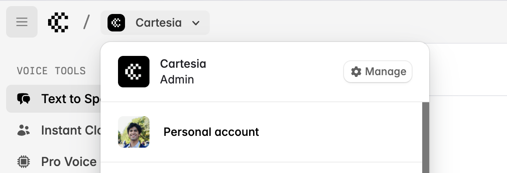
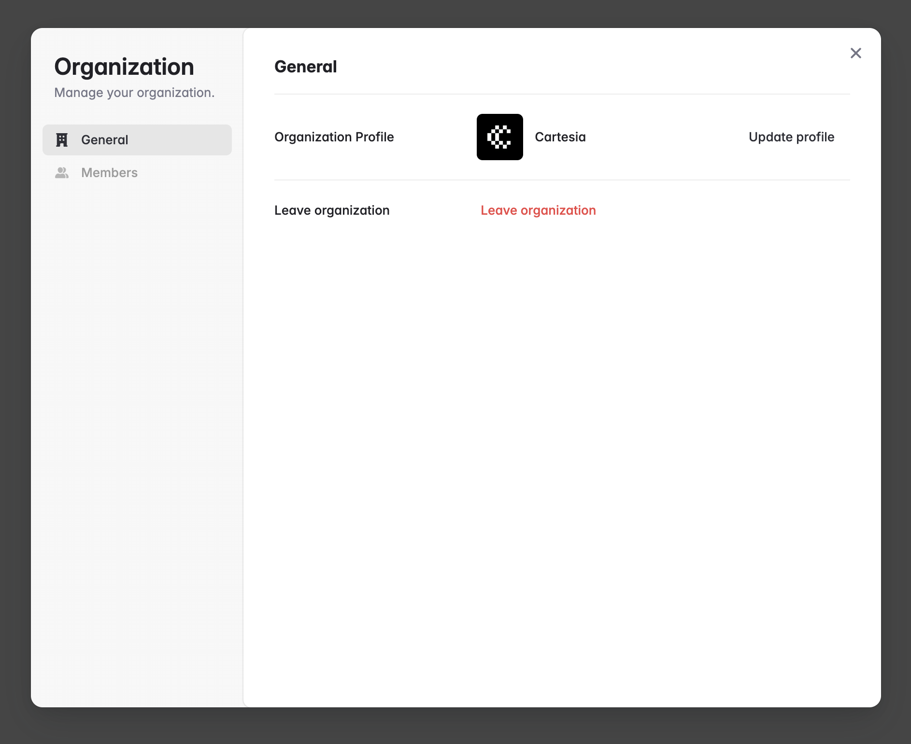

Cartesia supports two types of workspaces in its dashboard:

1. **Personal account (default):** The "Personal account" workspace is a user's unique, individual space, independent of any organization.
2. **Organizations:** Organization workspaces enable collaboration between multiple team members, who share the same view of all resources except playground generation history and starred voices, which are per-user in the organization.

<Warning>
	Organizations are not eligible for free credits, and must be upgraded to Startup tier or above before team members can be invited. Once you upgrade your organization, you can invite unlimited users to it for free.
</Warning>

<Steps>

### Create an organization

You can create an organization by going to the playground at [https://play.cartesia.ai](https://play.cartesia.ai), selecting the workspace switcher, and clicking **Create organization**.

<Frame background="subtle">
  
</Frame>

This will bring up a dialog where you can name your organization and upload a logo.

<Frame background="subtle">
  
</Frame>

Once you hit "Create organization", you will be redirected to the billing page to upgrade the organization to a higher tier.

### Upgrade your organization

<Note>
If you are already on the Enterprise plan, reach out and we will migrate your current subscription to an organization account for you.
</Note>

Organizations must be upgraded to the Startup tier or above before team members can be invited.

1. Each workspace has its own billing and credit limits, so you will need to check out again as the organization and then cancel your personal account subscription.
2. After you cancel, you have until the end of your current billing period to transfer all production-critical resources to your organization and issue and use new API keys from the organization.

### Invite your team

Once you've upgraded your organization, you can use the "Manage" button in the workspace switcher to manage it:

<Frame background="subtle">
  
</Frame>

This pops up a modal where you can change your profile and invite your team:

<Frame background="subtle">
  
</Frame>

You can invite unlimited team members in a paid organization.

### Create voices, API keys, and other resources in your organization

Once you create and upgrade an organization, you can create voices, API keys, and more in the organization. They will be available to all users in the organization. The only exceptions are playground generation history and starred voices, which are per-user in the organization.

</Steps>

## Migrating from a single enterprise account with multiple linked emails to an organization

Please reach out to us at support@cartesia.ai for assistance with this migration.
