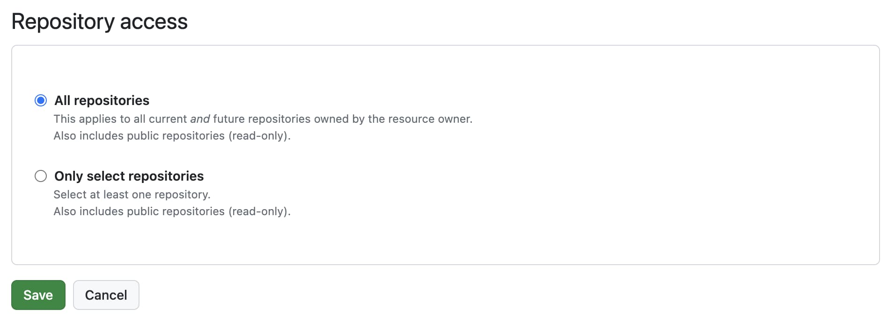
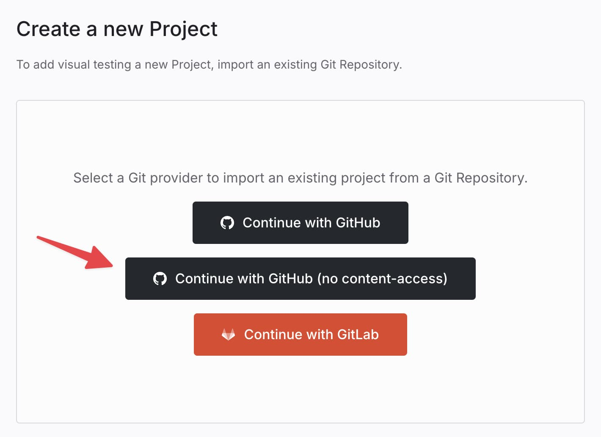

# Integrating Argos with GitHub

Seamlessly integrate Argos with GitHub for automated visual testing directly within your workflow. Connect Argos to your repositories and receive instant feedback on your pull requests, making it easier to maintain visual consistency across your project.

## GitHub Connect

Use GitHub Connect to log in to Argos with your GitHub account. This integration allows Argos to access your repositories and streamline the setup process.

## Argos' GitHub App

Argos provides a dedicated GitHub App that connects directly to your repositories, enabling real-time visual testing feedback on pull requests.

### Install the Argos GitHub App

1. Visit the [Argos app page on GitHub](https://github.com/apps/argos-ci).
2. Click on "Configure" and select the organization where you want to install Argos.
3. Follow the prompts to complete the installation.

### Import a GitHub Repository to Argos

1. Sign in to Argos and click on "Create a new project".
2. Choose GitHub as your provider, then click "Import your repository."

### Update the Repositories Shared with Argos

1. Go to the [Argos app page on GitHub](https://github.com/apps/argos-ci) and click "Configure".
2. Select the organization where you want to manage repository access.
3. Under "Repository access," choose "Only select repositories" and select the specific repositories you wish to share with Argos.

## GitHub Integration without Content Permission

If you prefer to use Argos without granting full content access to your repositories, you can now integrate via a more restricted setup.

### Setting Up Argos with Limited GitHub Access

1. Navigate to Team Settings in your Argos dashboard.
2. In the "GitHub without content access" section, click Install GitHub App.

3. On the next screen you are redirected to GitHub, choose the specific repositories where you want to install the Argos app.

4. Go to Team Projects in Argos.
5. Click Create a new project.
6. Select Continue with GitHub (no-content access).

7. Choose the repository you want to connect.
