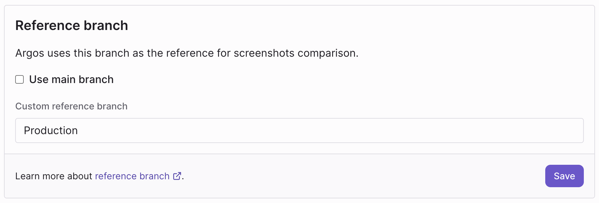

# Run on Preview Deployments

Seamlessly test preview deployments with Argos: Automate visual testing on platforms like Vercel, Cloudflare, and Netlify via GitHub Actions.

## Configure a GitHub Action

For Argos to work with your deployment previews, your deployment service must be integrated with GitHub to create deployments. This setup allows Argos to trigger tests on successful deployment previews.

### GitHub Workflow Configuration

Here's how to configure a GitHub Action to trigger tests with Argos on deployment previews. Create a workflow file in `.github/workflows` directory like so:

```yml
name: Playwright + Argos Tests

on:
  deployment_status:
jobs:
  run-e2es:
    # Run tests only if the deployment is successful
    if: github.event_name == 'deployment_status' && github.event.deployment_status.state == 'success'
    runs-on: ubuntu-latest
    steps:
      - uses: actions/checkout@v4
      - uses: actions/setup-node@v3
      - name: Install dependencies
        run: npm ci && npx playwright install --with-deps
      - name: Run tests
        run: npx playwright test
        env:
          # Use this environment variable as `baseUrl` in your playwright.config.ts
          BASE_URL: ${ github.event.deployment_status.environment_url }
          # Argos uses GITHUB_TOKEN to collect branch and pull request information
          GITHUB_TOKEN: ${ secrets.GITHUB_TOKEN }
          # Set the branch when your deployment runs on "Production" environment.
          ARGOS_BRANCH: ${ github.event.deployment_status.environment == 'Production' && 'main' || '' }
```

**Environment Variables Explained:**

- `BASE_URL`: Set to your deployment URL, for running E2E tests on the actual preview.
- `GITHUB_TOKEN`: Used by Argos for accessing branch and PR info. [Provided by default by GitHub](https://docs.github.com/en/actions/security-guides/automatic-token-authentication).
- `ARGOS_BRANCH`: Needed when deploying to "Production". Argos requires you to manually specify the branch in this case.

### Disable Vercel Toolbar

The Vercel Toolbar might appear in your screenshots. Here's [how to disable it](https://vercel.com/docs/workflow-collaboration/vercel-toolbar#disable-toolbar-for-session) for cleaner test visuals:

**For Playwright:**

```ts
// playwright.config.ts

export default defineConfig(
  use: {
    extraHTTPHeaders: {
      "x-vercel-skip-toolbar": "1",
    ,
  },
});
```

**For Cypress:**

```ts
// support/index.js
beforeEach(() => 
  cy.intercept(`${Cypress.config("baseUrl")**`, (req) => 
    req.headers["x-vercel-skip-toolbar"] = "1";
  );
});
```

### Opting Out of `GITHUB_TOKEN`

If you prefer not to use `GITHUB_TOKEN` due to security concerns, be aware of the following limitations:

- Deployments will be linked to the branch name rather than specific PR info.
- No direct PR link will be available in Argos.

To mitigate these limitations, it's important to designate your main production environment (e.g., "Production" in Vercel) as the "reference branch" in your project's Argos settings.



To configure without GITHUB_TOKEN:

```yml
name: Playwright + Argos Tests

on:
  deployment_status:
jobs:
  run-e2es:
    # Run tests only if the deployment is successful
    if: github.event_name == 'deployment_status' && github.event.deployment_status.state == 'success'
    runs-on: ubuntu-latest
    steps:
      - uses: actions/checkout@v4
      - name: Install dependencies
        run: npm ci && npx playwright install --with-deps
      - name: Run tests
        run: npx playwright test
        env:
          # Use this environment variable as `baseUrl` in your plawright.config.ts
          BASE_URL: ${ github.event.deployment_status.environment_url }
```

Argos SDKs show a warning when a `GITHUB_TOKEN` is not set. You can suppress this warning by setting the `DISABLE_GITHUB_TOKEN_WARNING` environment variable to true.
